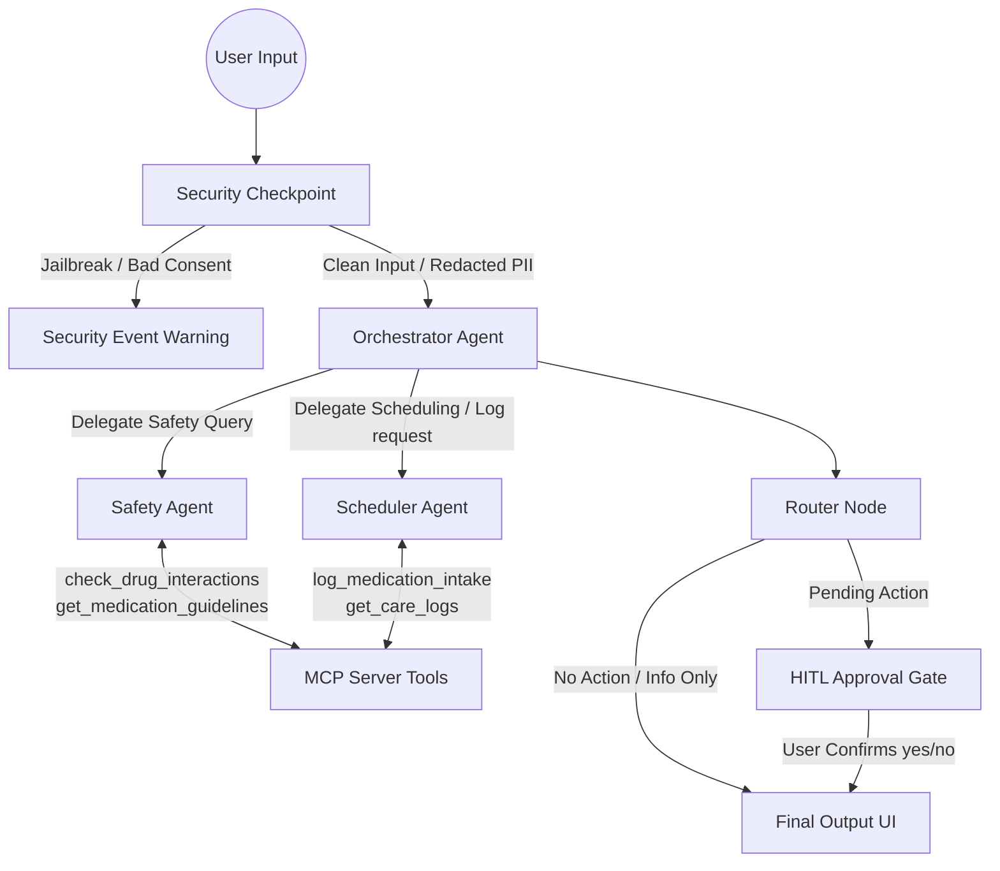

# Med-Companion — Personalized Medical Schedule & Safety Assistant

Med-Companion is an intelligent, secure, multi-agent assistant designed to help patients decipher medication schedules, verify safety guidelines, check for adverse drug-drug interactions, and log daily intake with human-in-the-loop validation.

## Prerequisites

- **Python**: Version 3.11 to 3.13
- **uv**: Astral's package manager
- **Gemini API Key**: Obtain a key from [Google AI Studio](https://aistudio.google.com/apikey)

## Quick Start

1. **Clone the repository:**
   ```bash
   git clone <your-repo-url>
   cd med-companion
   ```

2. **Configure Environment Variables:**
   Copy the example environment file and insert your API key:
   ```bash
   cp .env.example .env
   # Add your GOOGLE_API_KEY to the .env file
   ```

3. **Install Dependencies:**
   ```bash
   make install
   ```

4. **Launch the Playground:**
   ```bash
   make playground
   # This will start the ADK web interface at http://localhost:18081
   ```

## Solution Architecture



## How to Run

- **Interactive Playground UI**: `make playground` (runs on http://localhost:18081)
- **Local Web Server Mode**: `make run` (runs FastAPI server)
- **Run Tests**: `make test`

## Sample Test Cases

### Case 1: PII Redaction & Guidelines Check
*   **Input**: `"My name is John Doe, my SSN is 123-45-6789, and my email is john@example.com. Can you tell me the guidelines for Metformin?"`
*   **Expected Behavior**: The Security Checkpoint scrubs the SSN and email, logs a warning in the security audit log, and passes the clean prompt to the Orchestrator. The Orchestrator delegates to the `safety_agent` which queries the guidelines for Metformin.
*   **Check**: In the UI, the response displays the recommended intake (with meals) and side effects, and the SSN and email are replaced with redacted placeholders. The log file `security_audit.log` shows the warning entry.

### Case 2: Drug Interaction Warning Check
*   **Input**: `"I am taking Aspirin and Warfarin. Is this safe?"`
*   **Expected Behavior**: The Orchestrator calls the `safety_agent`. The `safety_agent` invokes the `check_drug_interactions` tool on the MCP server and returns the clinical hazard warning.
*   **Check**: The UI displays a warning: `⚠️ Interaction [aspirin + warfarin]: Bleeding hazard...` and advises consulting a provider.

### Case 3: Medication Intake Logging (HITL)
*   **Input**: `"Can you log that I took 1 pill of Metformin now?"`
*   **Expected Behavior**: The Orchestrator delegates to `scheduler_agent` which triggers the `request_log_action` tool. This tool sets a pending action in the session state. The workflow router detects this and diverts execution to the `hitl_approval` node.
*   **Check**: The runner halts and prompts the user in the UI with a confirmation button/input: `✋ Med-Companion requires your approval to perform the following action: Log Medication...`. Replying "yes" logs the entry in `care_logs.json`.

## Assets

Once generated, the following diagrams can be found in the assets folder:
- **Workflow Diagram**: 
- **Cover Page Banner**: 

## Demo Script

The narrative demo script for presentation is available here:
- [DEMO_SCRIPT.txt](file:///Users/viveknarvariya/Desktop/ADK.workspace/med-companion/DEMO_SCRIPT.txt)

## Push to GitHub

1. Create a new repo at https://github.com/new
   - Name: `med-companion`
   - Visibility: Public or Private
   - Do NOT initialize with README (you already have one)

2. In your terminal, navigate into your project folder:
   ```bash
   cd med-companion
   git init
   git add .
   git commit -m "Initial commit: med-companion ADK agent"
   git branch -M main
   git remote add origin https://github.com/viveknarvariya555-stack/med-companion
   git push -u origin main
   ```

3. Verify `.gitignore` includes:
   - `.env` (Your API key — must NEVER be pushed)
   - `.venv/`
   - `__pycache__/`
   - `*.db`
   - `artifacts/`

## Troubleshooting

1.  **429 Quota Exceeded (Resource Exhausted)**:
    - *Fix*: Switch your model in `.env` to `GEMINI_MODEL=gemini-2.5-flash-lite`, which has significantly higher free tier limits.
2.  **503 Service Unavailable / High Demand**:
    - *Fix*: This is a transient Google Gemini API overload error. Wait a few seconds and try resubmitting your query.
3.  **Port Conflict (18081 already in use)**:
    - *Fix*: Stop the conflicting process by running:
      `lsof -i :18081` followed by `kill -9 <PID>`, or change the port using `make playground --port <new_port>`.
