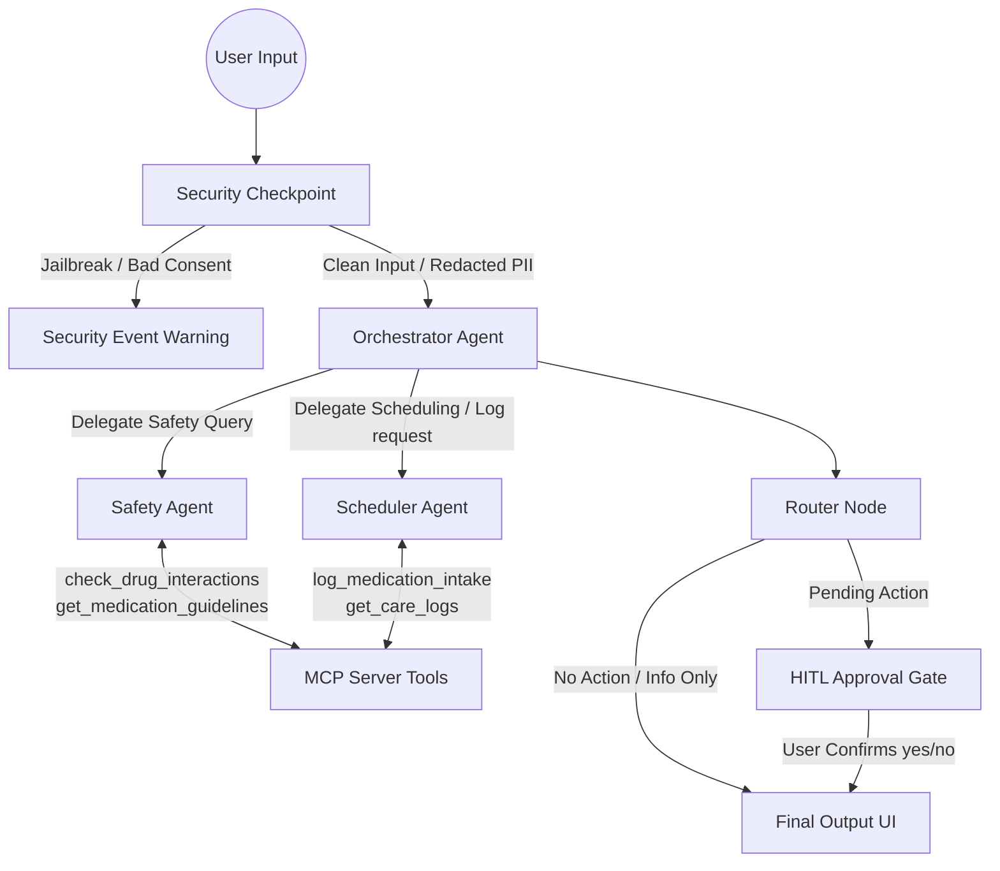

# Med-Companion — Submission Write-Up

## Problem Statement
Patients often face challenges managing complex medication regimens, deciphering recommended intake instructions, and checking for potential adverse drug interactions. Additionally, entering sensitive healthcare queries on local web forms risks leaking Personally Identifiable Information (PII). Med-Companion addresses these problems by providing an automated, secure multi-agent workflow that acts as a personalized patient care companion.

## Solution Architecture

## Concepts Used
This project demonstrates key agentic architectures built with Google Agent Development Kit (ADK) 2.0:
1.  **ADK Workflow Graph API**: Implemented in `app/agent.py`. Defines structural control flow starting from the entrypoint `START` through to specialized processing nodes.
2.  **LlmAgent Sub-Agents**:
    - `safety_agent` (clinical queries)
    - `scheduler_agent` (reminders and logging)
    - `orchestrator` (coordination)
3.  **AgentTool**: Used by the `orchestrator` to delegate execution control to the specialized sub-agents.
4.  **MCP Server**: Implemented in `app/mcp_server.py`. Provides domain-specific database interfaces using the Model Context Protocol.
5.  **Security Checkpoint**: Intercepts queries to perform PII filtering, audit logging, and injection mitigation.
6.  **Human-in-the-Loop (HITL)**: Utilizes `RequestInput` inside the `hitl_approval` node to prompt the user before writing intake events to care logs.

## Security Design
The workflow enforces robust data safety controls at the first entry node:
-   **PII Masking**: RegEx patterns scrub emails, phone numbers, and SSNs, protecting patient identity before reaching the model.
-   **Injection Detection**: Scans user prompts for jailbreak keywords and immediately routes to `security_event` to prevent adversarial attacks.
-   **Structured Audit Logging**: Logs every security checkpoint evaluation to `security_audit.log` as a JSON line for tracking access compliance.
-   **Consent Enforcement**: Simulates patient consent checks, preventing any processing if consent revocation is detected.

## MCP Server Design
The FastMCP server (`app/mcp_server.py`) exposes 4 clinical database tools:
1.  `check_drug_interactions`: Detects high-risk drug-drug interaction pairs (e.g. Aspirin + Warfarin).
2.  `get_medication_guidelines`: Fetches recommended intake schedules and warnings for common medications.
3.  `log_medication_intake`: Logs intake events (time, drug, dose) to a local JSON file.
4.  `get_care_logs`: Retrieves past care history.

## HITL (Human-in-the-Loop) Flow
Sensitive actions like logging medication intake must be authorized. When a user requests to log an intake, the scheduler agent invokes `request_log_action` to stage the request in `ctx.state["pending_action"]`. The workflow routes to `hitl_approval`, yielding a `RequestInput` that pauses execution. Once the user replies `yes`, the workflow writes to `care_logs.json` and resumes.

## Value Statement
Med-Companion combines secure local filtering with agentic reasoning to improve medication adherence and safety. By keeping a human in the loop for actions and checking interactions dynamically, it bridges the gap between static databases and intelligent healthcare guidance.
